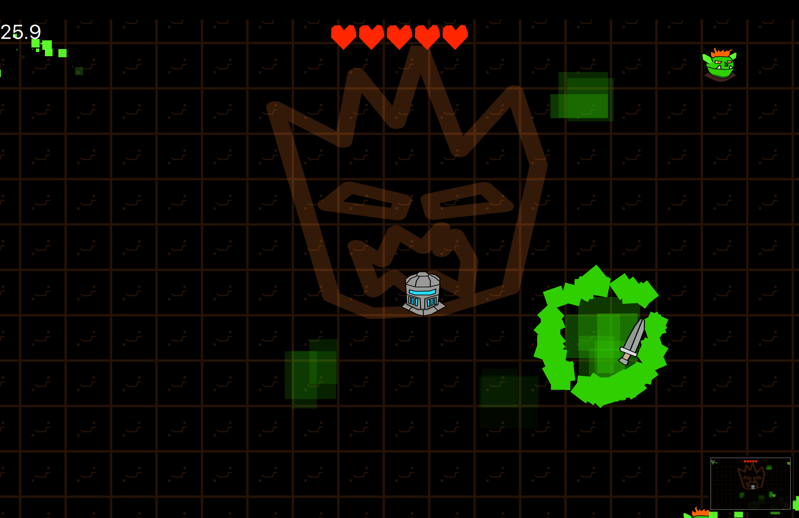

# Ludum Dare 50 - Delay the Inevitable 
This is the repository is the result of my development activities in the scope of Dare 51. 
Unfortunately, I didn't finished the game in time. But it is playable, just has not sound effects and menus yet. 
It can be built using C++ toolchain + Qt 6.4.

## Story
You are a knight and you have to withstand the summoners long enough to get strong enough.
Be prepared, they will summon a powerful magma demon (which didn't make it into the game ;) ).

## Screenshot:

